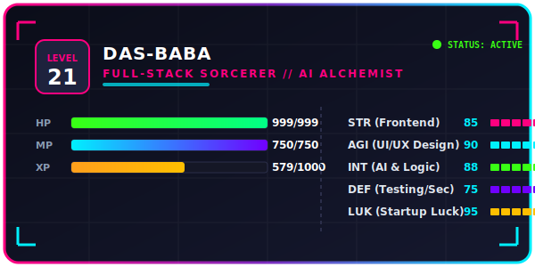
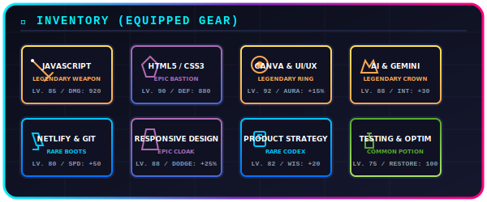

  

---

### 🌸 VISUAL NOVEL DIALOGUE (START GAME)

  <table border="0" cellpadding="10" cellspacing="0" style="border: 3px solid #ff8fa3; border-radius: 15px; background-color: #1c0f16; width: 100%; max-width: 750px; box-shadow: 0 0 15px rgba(255, 143, 163, 0.4);">
    <tr>
      <td width="25%" align="center" valign="middle" style="border-right: 2px dashed #3e1f31; padding: 15px;">
        
         
        <strong style="color: #ffffff; font-family: 'Georgia', serif; font-size: 14px; font-style: italic;">Sakura Guide</strong>
         
        [Companion / AI]
      </td>
      <td width="75%" valign="top" style="color: #ffd3e2; font-family: 'Georgia', serif; font-size: 14.5px; padding: 18px; line-height: 1.6;">
        <strong style="color: #ffb7c5; font-family: monospace;">&gt; DIALOGUE ACTIVE:</strong>
          
        <i>"Ah, traveler! You have wandered into the Sakura Code Garden. I am the guardian of this space, representing Saumil Prajapati (DAS-BABA) — a developer, tech innovator, and startup alchemist who shapes beautiful products from lines of logic. Every cherry blossom here marks a project completed or a skill mastered. Let's walk the garden path together..."</i>
          
        <strong style="color: #ffe259; font-family: monospace;">&gt; CHOOSE ACTIONS:</strong>
         
        🌸 <a href="#-sakura-status" style="color: #ffccd5; text-decoration: none; font-weight: bold;">[ 📊 Inspect Status Card ]</a> 
        🎒 <a href="#-sakura-inventory" style="color: #ffccd5; text-decoration: none; font-weight: bold;">[ 🎒 View Grace Inventory ]</a> 
        📜 <a href="#-quest-board-active--completed" style="color: #ffccd5; text-decoration: none; font-weight: bold;">[ 📜 Browse Quest Board ]</a> 
        🤝 <a href="#-guild-hall-co-op-mode" style="color: #ffccd5; text-decoration: none; font-weight: bold;">[ 👥 Summon / Team Up ]</a>
      </td>
    </tr>
  </table>

---

### 📊 SAKURA STATUS

  

*   **Guardian Persona:** Saumil Prajapati (`DAS-BABA`)
*   **Class Path:** `Sakura Architect // Code Alchemist`
*   **Active Enchantment:** Building digital interfaces that feel as fluid as falling blossoms, blending utility, aesthetics, and intelligence.

---

### 🎒 SAKURA INVENTORY

  

#### 🌸 EQUIPPED SPELLS & GRACE STATS

| Equipped Gear | Type / Slot | Rarity | Main Attribute | Item Lore & Buffs |
| :--- | :--- | :--- | :--- | :--- |
| 🌸 **JavaScript Spellbook** | Weapon / Catalyst | LEGENDARY | `+85 STR` (Frontend Spells) | Core weapon utilized to script highly responsive frontend interactions. |
| 🛡️ **HTML5 & CSS3 Aegis** | Shield / Offhand | EPIC | `+90 DEF` (Grid Defense) | Shield of structure, locking layouts into beautiful, responsive alignments. |
| 🎨 **Canva & UI/UX Amulet** | Accessory / Ring | LEGENDARY | `+92 AGI` (Aura Modifier) | Enchanted trinket boosting product visual harmony and user experience. |
| 👑 **Gemini AI Circlet** | Headwear / Crown | LEGENDARY | `+88 INT` (Cognition Core) | Crown channeling Gemini LLM APIs to drive autonomous bots and site generators. |
| 🥾 **Netlify & Git Greaves** | Footwear / Boots | RARE | `+80 SPD` (Speed Deployment) | Relic boosting delivery speeds for continuous deployment and sync tasks. |
| 👘 **Responsive Kimono** | Armor / Robes | EPIC | `+25% EVADE` (Adaptability) | Fabric that auto-shapes itself to gracefully fit mobile, tablet, or desktop viewports. |
| 📜 **Product Strategy Scroll** | Accessory / Book | RARE | `+20 WIS` (Insight) | Scroll containing patterns for MVP sizing, startup growth, and user flows. |

---

### 📜 QUEST BOARD: ACTIVE & COMPLETED

<b>🔥 QUEST IN PROGRESS: The AI Companions (chatbotmarco &amp; Co.)</b>

 

> **Objective:** Forge Gemini-powered website generators and conversational intelligence bots.
> 
> *   **Quest Rarity:** LEGENDARY
> *   **Progress:** `[🌸🌸🌸🌸🌸🌸🌸🌸░░] 80%`
> *   **Expected Drop:** `AI Cognitive Core`, `Infinite Code Generator`
> *   **Quest Log:**
>     *   **chatbotmarco**: An intelligent website generation tool designed to transform prompts into functional layouts.
>     *   **AI Interview Coach**: Dynamic trainer evaluating user replies using speech-to-text integration.
>     *   **ProofForge & NeuroSkill**: Automated utilities streamlining developmental tracking.

<b>🟢 QUEST COMPLETED: The Polaroid Bazaar (Noira)</b>

 

> **Objective:** Build a customized, interactive e-commerce platform.
> 
> *   **Quest Rarity:** EPIC
> *   **Status:** `SUCCESS (100% Resolved)`
> *   **XP Gained:** `+1,500 XP`
> *   **Reward Loot:** `Custom Polaroid Printing Blueprint`
> *   **Quest Log:** Crafted a tailored digital boutique for Polaroids, phone cases, and mobile skins, complete with customize-on-page scripts and a direct WhatsApp checkout pipeline.

<b>🟢 QUEST COMPLETED: The Rhythm Sanctuary (Interactive Music Platform)</b>

 

> **Objective:** Design an immersive music browser dashboard.
> 
> *   **Quest Rarity:** RARE
> *   **Status:** `SUCCESS (100% Resolved)`
> *   **XP Gained:** `+1,200 XP`
> *   **Reward Loot:** `Legendary Headset (+10% Deep Focus)`
> *   **Quest Log:** Developed a high-fidelity web music dashboard featuring sidebar playlist trees, fluid CSS audio controllers, and micro-animated layouts.

<b>🟢 QUEST COMPLETED: Spiritual Alignment (Bajrang Baan Devotional)</b>

 

> **Objective:** Deploy a blazing-fast spiritual chanting sanctuary.
> 
> *   **Quest Rarity:** COMMON
> *   **Status:** `SUCCESS (100% Resolved)`
> *   **XP Gained:** `+800 XP`
> *   **Reward Loot:** `Blossom Blessing (+5% Luck)`
> *   **Quest Log:** Created a mobile-first devotion page focused on fast loading, minimal asset size, clean typography, and spiritual alignment.

<b>🟢 QUEST COMPLETED: Transit Network Concept (BusPro)</b>

 

> **Objective:** Create a dashboard for fleet routing and tracking.
> 
> *   **Quest Rarity:** RARE
> *   **Status:** `SUCCESS (100% Resolved)`
> *   **XP Gained:** `+1,000 XP`
> *   **Reward Loot:** `Compasses of Clear Travel`
> *   **Quest Log:** Modeled route tracking controls, passenger schedules, and smart layout maps for transport monitoring.

---

### 📊 GARDEN ANALYTICS (SERVER READOUT)

  <table border="0" cellpadding="0" cellspacing="10">
    <tr>
      <td valign="top">
        
      </td>
      <td valign="top">
        
      </td>
    </tr>
    <tr>
      <td colspan="2" align="center">
         
        
      </td>
    </tr>
  </table>

---

### 🤝 GUILD HALL (CO-OP MODE)

*   **Guild Architect:** Saumil Prajapati
*   **Active Roles:** `Founder`, `Lead Product Developer`, `Automation Specialist`
*   **Guild Motto:** *"Dream Big. Build Bigger."*
*   **Join Party:** Seeking co-op companions for Hackathons, Startups, Open Source Raids, and new Web Products.

  
  &nbsp;&nbsp;
  

   
  

